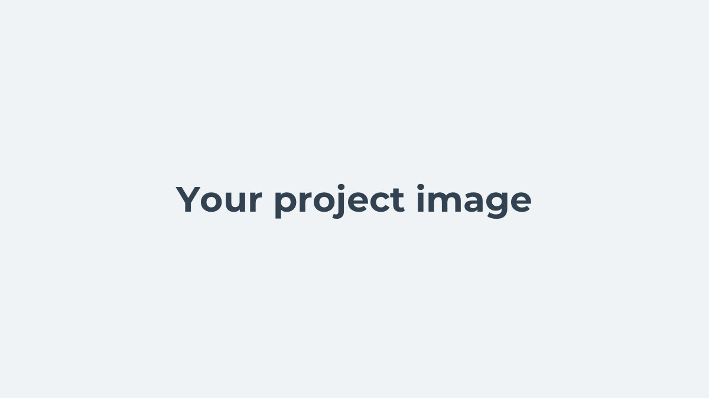

# Your project name

A short description about your project.

## Installation

1. Clone the repository: `git clone git@your-repository-url.git`.
1. Navigate into the project folder: `cd your-repository-name`.
1. Remove the git folder: `rm -rf .git`.
1. Create a empty repository: `git init`.
1. Install the dependencies: `yarn install`.

## Commands

Run these commands in the terminal with `npm run COMMAND` or `yarn COMMAND`.

| Command     | Description                          |
| ----------- | ------------------------------------ |
| start       | Starts the metro bundler             |
| run:ios     | Runs the app in an iOS simulator     |
| run:android | Runs the app in an Android simulator |
| pod:install | Installs the native iOS dependencies |
| lint        | Runs TSLint                          |
| format      | Runs Prettier                        |
